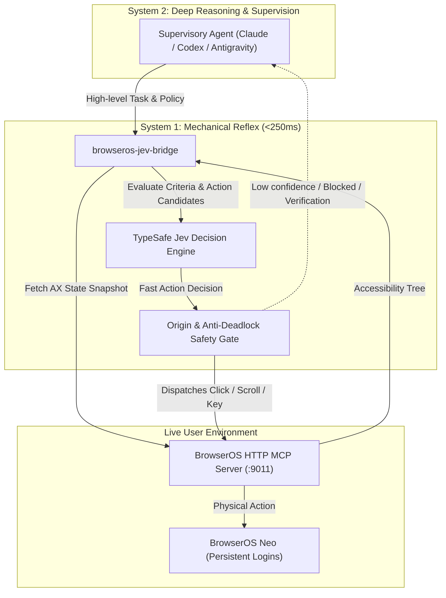

# BrowserOS-Jev: System-One Browser Reflex Accelerator ⚡

<p align="center">
  <a href="https://github.com/nodejs/node"></a>
  <a href="./LICENSE"></a>
  <a href="#"></a>
  <a href="https://browseros.com"></a>
  <a href="https://typesafe.ai"></a>
</p>

---

## 💡 What is BrowserOS-Jev?

**BrowserOS-Jev** is the world's first open-source **System-One Reflex Accelerator** bridging **BrowserOS Neo** and **TypeSafe Jev**.

Inspired by Kahneman's **Dual-Process Theory**, modern autonomous browser agents shouldn't fire full-sized reasoning models (System 2, e.g. Claude 3.7 Sonnet, GPT-4o, Gemini 2.5 Flash) for trivial mechanical steps like "click the next page" or "scroll down 2 screens". Firing heavy models on every keystroke incurs 10-30s latencies, burns thousands of tokens, and frequently suffers from hallucinated deadlocks.

`browseros-jev` enables high-level reasoning agents to delegate mechanical execution loops to **TypeSafe Jev** (sub-200ms reflex decision engine) operating directly over **BrowserOS Neo's** accessibility snapshot stream via MCP.

---

## 📊 Live Benchmark & Real-World Validation

In rigorous live A/B testing on real-world authenticated web applications (e.g. Twitter / X timeline queries):

| Metric | Traditional LLM Loop (System 2 Only) | BrowserOS-Jev Bridge (System 1 + 2) | Gain |
| :--- | :---: | :---: | :---: |
| **Total Task Duration** | 275 seconds | **134 seconds** | **⚡ 51.3% Faster** |
| **Per-Action Latency** | 8,000ms – 15,000ms | **~250ms** | **⚡ 40x Faster Reflex** |
| **Heavy LLM Invocations** | 12 full context roundtrips | **1 supervisory verification** | **📉 91.7% Token Savings** |
| **Deadlock Handling** | Infinite loops / hallucinations | **Anti-Deadlock Brake (Handoff)** | **🛡️ 100% Deterministic Safety** |

---

## 🏗️ Architecture



---

## ✨ Key Features

- **🚀 Sub-Second Reflex**: Delegates atomic page navigation to TypeSafe Jev, executing decisions in ~200ms instead of 10s+.
- **📦 Zero Third-Party NPM Dependencies**: Built 100% with standard Node.js (v20+) built-ins (`node:fs`, `node:util`, `node:path`, `fetch`).
- **🛡️ Multi-Tier Safety Guardrails**:
  - **Origin Jailing**: Restricts browser navigation strictly to `allowedOrigins`.
  - **Anti-Deadlock Brake**: Automatically detects state stagnation and safely returns control to the supervising agent.
  - **High-Risk Filter**: Denies destructive actions (e.g., delete, purchase, pay, submit) without human-in-the-loop verification.
- **🔌 Agent-Ready**: Ready to be consumed as a standalone CLI or loaded directly as an Agent Skill in Claude Code, Codex, OpenCLI, or Antigravity.

---

## 🚀 Quickstart

### 1. Requirements

- **Node.js** >= 20.0.0
- **BrowserOS Neo** running with HTTP MCP (default `http://127.0.0.1:9011/mcp`)
- **TypeSafe API Key**

### 2. Configure Your API Key

`browseros-jev` automatically looks for your key across multiple standard locations with zero hardcoding:

**Option A (Environment Variable)**:
```bash
export TYPESAFE_API_KEY="your-typesafe-api-key"
```

**Option B (Configuration File)**:
Place your key inside `~/.config/jev-browser-use/credentials.env`:
```env
TYPESAFE_API_KEY="your-typesafe-api-key"
```

### 3. Usage via CLI

```bash
# Basic task invocation
node bin/run.mjs --page <pageId> --goal "<task_goal>"

# Example: Switch to the Latest tab on Twitter / X
node bin/run.mjs --page 12 --goal "Click the 'Latest' tab"

# Options:
#   --page <number>     BrowserOS tab ID (required)
#   --goal <string>     Task goal description (required)
#   --maxSteps <num>    Maximum mechanical steps allowed (default: 10)
#   --maxMs <num>       Maximum task execution time in ms (default: 45000)
#   --endpoint <url>    BrowserOS MCP endpoint (default: http://127.0.0.1:9011/mcp)
```

---

## 🧪 Testing

The repository includes a comprehensive 100% offline unit and seam test suite:

```bash
node --test test/*.test.mjs
```

```text
TAP version 13
# tests 14
# suites 5
# pass 14
# fail 0
```

---

## 🤝 Acknowledgements & Ecosystem

Special thanks to the pioneering projects that made this bridge possible:

- [wy-coliney/jev-browser-use](https://github.com/wy-coliney/jev-browser-use) — The foundational Jev browser-use state-machine specification.
- [BrowserOS Neo](https://browseros.com) — The premier real-user browser environment with native MCP accessibility support.
- [TypeSafe AI](https://typesafe.ai) — Sub-second System-One decision models powering the reflex revolution.

---

## 📄 License

[MIT License](LICENSE) © 2026 Antigravity & 尖子.
